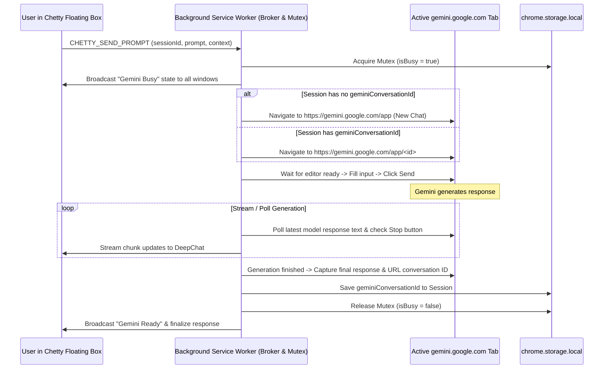

# Implementation Plan: Gemini Web Automation Provider (Replacing OAuth)

Pivot Chetty's AI backend from Google OAuth/API to a browser automation bridge that simulates and scrapes a real, active `gemini.google.com` tab.

## User Review Required

> [!IMPORTANT]
> **Gemini Web Automation Architecture**:
> - **Zero OAuth / API keys**: Complete removal of `src/auth/` OAuth code and callback pages.
> - **Active Tab Requirement**: The user must have at least one tab open to `https://gemini.google.com/*` and be signed into their Google account on the web.
> - **Single-Threaded Automation (Busy Lock)**: Because 1 physical Gemini Web tab is driven, only 1 prompt can be generated at a time. All active chatbox windows will display a live loading/queue indicator whenever the Gemini tab is busy generating.
> - **Session Mapping**:
>   - Chetty sessions map 1-to-1 to Gemini web conversations via `geminiConversationId` (`https://gemini.google.com/app/<id>`).
>   - When prompting, the background worker verifies the Gemini tab is on the matching conversation URL (navigating or clicking the chat in history if needed), types the prompt into Gemini's editor, submits, and monitors the streaming response until completion.

---

## Proposed Architectural Flow



---

## Detailed Component Changes

### 1. Remove OAuth Code & Callback Entrypoint
- Delete `src/auth/` (`config.ts`, `oauth.ts`, `token-manager.ts`).
- Delete `entrypoints/oauth-callback/` (`index.html`, `main.ts`).
- Remove OAuth redirect URL from manifest / build configuration.
- In `src/types/settings.ts`: Replace `UserAuth` with `GeminiWebConfig`:
  ```typescript
  export interface GeminiWebConfig {
    selectedTabId: number | null;
    selectedTabTitle?: string;
    isBusy: boolean;
    activeSessionId?: string | null;
  }
  ```

### 2. Provider Extension Interface & Gemini Web Provider
- Extend `IChatProvider` in `src/types/provider.ts`:
  - `renderSettings(container: HTMLElement): Promise<void>`: Allows providers to inject custom configuration UI into the extension popup.
- Implement `GeminiWebProvider` in `src/providers/gemini.ts`:
  - Queries tabs matching `https://gemini.google.com/*`.
  - Injects `Select Gemini Active Web` dropdown and refresh/open button into the extension popup.
  - Sends prompts through background broker.

### 3. Session Store (`src/types/session.ts` & `src/storage/session-store.ts`)
- Add `geminiConversationId?: string` to `ChatSession`.
- When first prompt completes, extract conversation ID from Gemini tab URL (`/app/<id>`) and persist it.

### 4. Background Automation Broker (`entrypoints/background.ts`)
- Manages `geminiTabId` and global prompt queue/mutex.
- Injects a script into `gemini.google.com` to:
  1. Detect input box (`div[contenteditable="true"]`, `rich-textarea`, or textarea).
  2. Set text via DOM events (`input`, `beforeinput`).
  3. Click send button (`button[aria-label*="Send"]`, `button.send-button`).
  4. Observe response container (`model-response`, `message-content`) and stream text updates.
  5. Detect when generation stops (absence of stop button or presence of send button).
  6. Return final text and new URL.

### 5. Extension Popup Menu (`entrypoints/popup/`)
- Replace the Google OAuth card with the provider-rendered `Select Gemini Active Web` UI:
  - Shows dropdown of open `gemini.google.com` tabs.
  - Status chip: 🟢 Connected to Gemini Web / 🔴 No Gemini tab open.
  - `Open gemini.google.com` shortcut button if none open.

### 6. Floating Chatbox Busy Indicator (`src/components/floating-window.ts`)
- Displays a synchronized status banner when Gemini Web is currently executing a prompt in any window:
  `[⏳ Gemini Web is generating... (Please wait)]`
- Disables deep-chat submit button while the Gemini Web tab is busy.

---

## Verification Plan

### Automated Build & Types
- `pnpm run compile` (verify 0 TypeScript errors).
- `pnpm run build:all` (verify Chrome and Firefox builds succeed).

### Functional Testing Flow
1. Open `https://gemini.google.com/app` in a browser tab and sign in.
2. Click Chetty popup -> see `Select Gemini Active Web` showing the active Gemini tab.
3. Open a webpage (e.g. Wikipedia), open Chetty, and send a prompt.
4. Verify:
   - Gemini tab inputs the text and sends.
   - Extension chatbox shows streaming / final scraped response.
   - Session stores `geminiConversationId`.
   - Busy indicator shows across tabs while generating.
   - Second prompt in same session continues in that conversation.
   - New session creates a new conversation on the Gemini tab.
