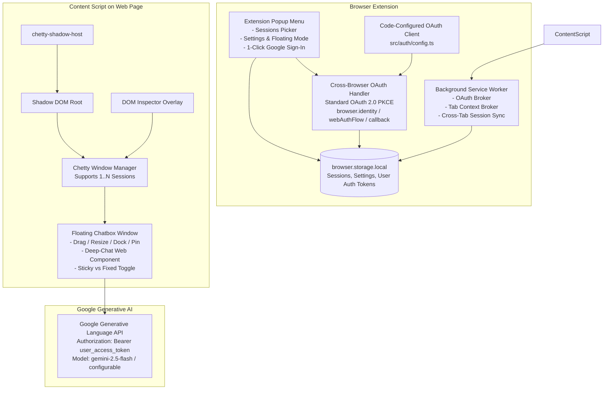

# Implementation Plan: Chetty - Spec-Driven Cross-Browser Chatbot Extension

Chetty is a cross-browser extension built on **WXT** (Manifest V3) that injects customizable, draggable, resizable, dockable floating chatbot windows directly into web pages. It features deep-chat UI, modular AI integration calling Gemini with the user's signed-in Google access token, multi-session management, synchronized conversations across tabs, rich context gathering (including inspect element mode, current tab extraction via `@extractus/article-extractor`, and cross-tab context), and dark/light theming.

## User Review Required

> [!IMPORTANT]
> **Pre-configured Cross-Browser Google OAuth (Code-Configured)**:
> - **Zero End-User Setup**: The Google Cloud Console OAuth Client ID and settings are configured directly in the codebase (`src/auth/config.ts`), so the end-user doesn't need to configure client IDs in their browser.
> - **1-Click Google Sign-In**: The user simply clicks "Sign in with Google" in the popup menu or inside the chatbox.
> - **User-Covered Quota/Billing**: The API requests to Google Generative Language / Cloud API use the user's signed-in `Authorization: Bearer <access_token>`.
> - **Cross-Browser Standard**: Standard OAuth 2.0 PKCE flow that works in Chrome, Firefox, Edge, Safari (no `chrome.identity`).
> - **No Gemini API Key needed**: Purely token-based authentication.

> [!IMPORTANT]
> **WXT and Shadow DOM Architecture**: To ensure zero style conflicts with target websites (and prevent malicious site styles/scripts from breaking the chatbot), all floating chat windows will be rendered inside an encapsulated **Shadow Root** using WXT's content script UI system.

---

## Architecture & System Design



---

## Proposed Project Structure

```
d:\Projects\chetty\
├── package.json
├── pnpm-lock.yaml
├── tsconfig.json
├── wxt.config.ts
├── entrypoints/
│   ├── background.ts            # Service worker (auth flow handler, tab broker, sync)
│   ├── popup/                   # Toolbar popup menu
│   │   ├── index.html
│   │   ├── main.ts
│   │   └── style.css
│   ├── oauth-callback.html      # Cross-browser OAuth redirect landing page
│   ├── oauth-callback.ts
│   └── content.ts               # Content script injected into web pages
├── src/
│   ├── types/
│   │   ├── session.ts           # Session & message types
│   │   ├── settings.ts          # Settings & preferences
│   │   └── provider.ts          # AI provider interfaces
│   ├── auth/
│   │   ├── config.ts            # Code-configured Google OAuth credentials & scopes
│   │   ├── oauth.ts             # Cross-browser Google OAuth 2.0 PKCE manager
│   │   └── token-manager.ts     # Access token lifecycle, expiry & profile fetcher
│   ├── storage/
│   │   ├── session-store.ts     # Multi-session persistence & syncing
│   │   └── settings-store.ts    # Config store (theme, opacity, dock, preferences)
│   ├── providers/
│   │   ├── base.ts              # IChatProvider interface & factory
│   │   └── gemini.ts            # Gemini provider (User access token + streaming)
│   ├── context/
│   │   ├── extractor.ts         # @extractus/article-extractor wrapper
│   │   ├── inspector.ts         # Interactive element boundary inspector
│   │   └── cross-tab.ts         # Multi-tab context aggregator
│   ├── components/
│   │   ├── floating-window.ts   # Draggable, resizable, dockable, minimizable window
│   │   ├── window-manager.ts    # Multi-session orchestrator per tab
│   │   └── permission-banner.ts # Permission check & prompt component
│   └── styles/
│       ├── floating-box.css     # Shadow DOM styles for floating boxes
│       └── inspector.css        # Highlight border & badge styles
├── assets/
│   ├── icons/                   # 16, 48, 128 PNG icons
│   └── logo.svg
└── CHROMEWEBSTORE.md            # Chrome Web Store listing & permission justifications
```

---

## Key Features & Proposed Implementation

### 1. Code-Configured Cross-Browser Google OAuth 2.0
- Google Cloud OAuth Client credentials configured directly in code (`src/auth/config.ts`).
- Standard OAuth 2.0 PKCE flow (cross-browser compatible across Chrome, Firefox, Edge, Safari; no `chrome.identity`).
- Scopes:
  - `https://www.googleapis.com/auth/generative-language.retriever`
  - `https://www.googleapis.com/auth/cloud-platform`
  - `openid`
  - `email`
  - `profile`
- 1-click "Sign in with Google" experience for users in the popup or chatbox.
- Stores user's access token and profile (name, email, avatar) in `browser.storage.local`.
- Calls Gemini using the user's `Authorization: Bearer <access_token>`, so usage/costs are tied to the user's authorized Google account.

### 2. Extension Toolbar Popup Menu
- **Extension Info**: Chetty branding, version badge, GitHub link, current sign-in status (Signed in as `user@gmail.com` or "Not signed in").
- **Session Actions**:
  - `Start new session`: Generates a new session, notifies active tab content script to spawn floating window.
  - `Show another session`: List/picker of existing sessions with last updated timestamp and message preview.
- **Customizable Preferences**:
  - Default floating mode: `fixed` (viewport static) vs `sticky` (scrolls with page).
  - Chatbox opacity slider (50% - 100%).
  - Light / Dark mode toggle.
  - 1-Click Google Sign-In / Sign-Out.
- **Permissions Status**: Live audit indicator showing if required permissions are granted.

### 3. Floating Chatbox Window (`floating-window.ts`)
- **Isolation**: Injected into document body inside a Shadow DOM (`chetty-shadow-host`).
- **Deep-Chat Integration**: Integrates `deep-chat` web component with customized theme, avatar, input styling, and streaming support.
- **Drag & Position**: Drag by header handle with boundary constraints.
- **Dynamic Resizing**: Custom resize handles on corners and edges with min/max constraints.
- **Minimization**: Shrinks to a sleek, floating pill badge displaying session title and unread indicator; click restores exact position and size.
- **Sticky vs Fixed**: Header toggle switch to change between viewport-fixed and page-scroll sticky.
- **Side Docking & Pinning**:
  - Dragging within 40px of left or right viewport edge automatically snaps/docks to that edge.
  - Pinned toggle:
    - **Pinned**: Applies smooth margin/padding to host `document.body` so the web page reflows and content is not obstructed.
    - **Unpinned**: Overlays floating directly above the web page.

### 4. Context Gathering Engine (`extractor.ts`, `inspector.ts`, `cross-tab.ts`)
- **No Context**: Clean conversational mode.
- **Current Tab Context**: Uses `@extractus/article-extractor` to extract clean main text, title, author, description, and selected text.
- **Another Tab Context**: Queries open tabs via background service worker and extracts content from any selected tab.
- **Specific Element Boundary (Inspect Mode)**:
  - Activates interactive DOM inspection.
  - Hovering elements highlights them with an animated bounding outline and metadata tag badge.
  - Clicking selects the element, grabs its `outerHTML` / text content and CSS selector, and attaches it as a context chip to the prompt input.
  - Pressing `Escape` cancels inspect mode.

### 5. Multi-Session & Cross-Tab Synchronization
- Persistent storage in `browser.storage.local`.
- Support multiple simultaneous floating windows per tab (independent sessions).
- `storage.onChanged` listener propagates new messages, title changes, and status to all open tabs and windows sharing that session ID in real-time.

### 6. Modular AI Provider Architecture
- Clean `IChatProvider` interface decoupling AI logic from the UI.
- `GeminiProvider`:
  - Calls Gemini endpoint using user's OAuth access token via `Authorization: Bearer <access_token>`.
  - Feeds multi-turn history (`user` and `model` turns) + system instruction with page context.
  - Real-time token streaming into `deep-chat`.

---

## Verification Plan

### Automated Build & Type Checking
- Run `pnpm run build` or `wxt build` to verify clean compilation without TypeScript or bundler errors.
- Verify manifest output contains valid MV3 keys, valid icons, and correct permissions.

### Functional Verification
- Test popup UI: Session creation, session switching, theme toggle, opacity slider, 1-click Google OAuth button.
- Test content script injection: Shadow DOM attached, deep-chat rendered.
- Test window manipulation: Dragging, resizing, minimizing/restoring, sticky/fixed toggle.
- Test docking & pinning: Snapping to left/right edge, pin mode adjusting `document.body` margin.
- Test context modes: Current tab extraction via `@extractus/article-extractor`, inspect element boundary highlight, and cross-tab context query.
- Test multi-tab sync: Verify storage changes propagate between simulated or active tabs.
